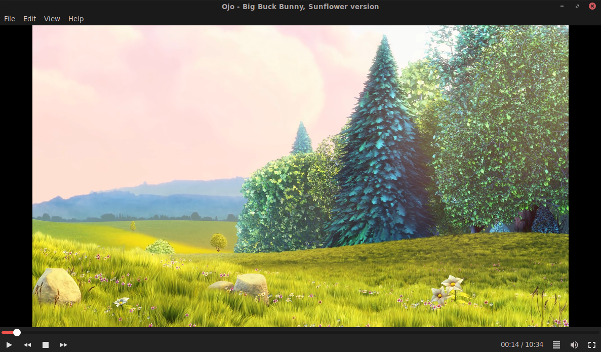

# 🎵 Ojo - GTK Media Player for Linux 🎶

Ojo is an **open-source** GTK-based media player for Linux, designed to provide a simple and elegant way to enjoy your music and videos. 🌟



---

## 🚀 Features

- 🎧 **Audio and Video Playback**: Supports a wide range of media formats via VLC and libVLC.
- 🎨 **Customizable Interface**: Toggle dark mode, border styles, and cover art display.
- 📜 **Playlist Management**: Easily manage and view your playlists.
- 🖼️ **Cover Art Display**: Automatically fetch and display album art for your music.
- 🖱️ **Mouse Sensitivity Control**: Adjust mouse sensitivity for fullscreen interactions.

---

## 🛠️ Installation

### 📋 Dependencies

Ensure you have the following dependencies installed:

- 🛠️ `gcc`
- 🛠️ `meson`
- 🛠️ `pkg-config`
- 🛠️ `gtk3`
- 🛠️ `vlc`
- 🛠️ `libvlc`

#### 🐧 Debian/Ubuntu
```bash
sudo apt install gcc meson pkg-config libgtk-3-dev vlc libvlc-dev
```

#### 🐧 Manjaro
```bash
sudo pacman -Syu gcc meson pkg-config gtk3 vlc
```

---

### 📦 Install from Source

Follow these steps to build and install Ojo:

```bash
git clone https://github.com/FreaxMATE/Ojo.git
cd Ojo/
meson build && cd build
ninja
sudo ninja install
```

### 🐧 Build with Nix

To build Ojo using Nix, you can use the provided Nix expressions.

#### Steps:

1. Clone the repository:
    ```bash
    git clone https://github.com/FreaxMATE/Ojo.git
    cd Ojo/
    ```
3. Enter the `package` directory:
    ```bash
    cd package
    ```

2. Build the package:
    ```bash
    nix-build -A ojo
    ```

4. Run the built binary:
    ```bash
    ./result/bin/ojo
    ```

---

## 📜 License

📝 Ojo is licensed under the terms of the **GPLv3** license. For more details, visit: [GNU GPLv3](https://www.gnu.org/licenses/gpl-3.0.html).

---

## ❤️ Contributing

We welcome contributions! Check out the [CONTRIBUTING.md](CONTRIBUTING.md) file for guidelines. Let's make Ojo even better together! 🤝

---

## 📷 Screenshot


---

Enjoy your media with Ojo! 🎉